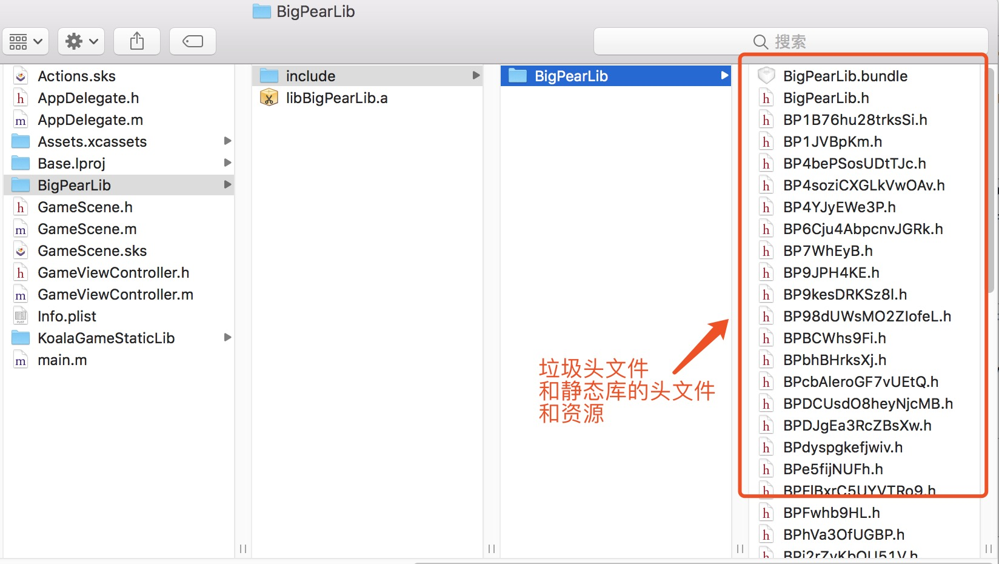
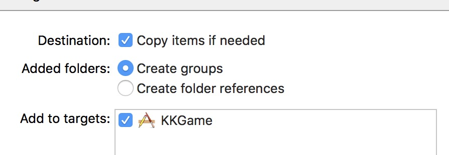
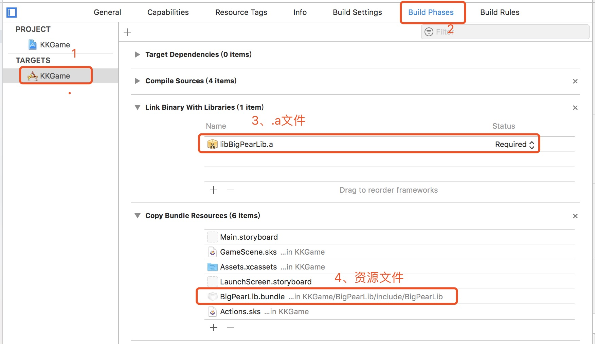
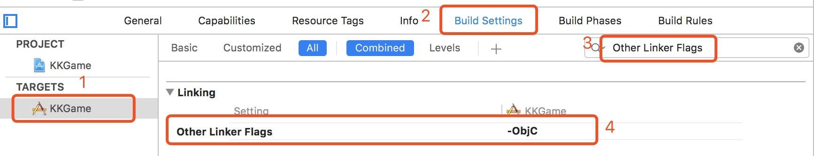

# 平台SDK混淆版通用接入文档【iOS端】


对应服务端的接入，请移步: [服务端接入文档](https://github.com/MagicDreamC/mksdk_IOS-4-0/blob/master/摩柯游戏平台sdk服务端接入文档%20v2.0.md)

+ 新增提示(2.0.18+, 3.0.3+)：
```objective-c
// 新接入的sdk里面如果有该方法-kgk_applicationWillTerminate:，请接入方在AppDelegate.m中的-applicationWillTerminate:方法中，添加对如下方法的调用
[Koala kgk_applicationWillTerminate: application];

// 接口说明
/**
 需要在AppDelegate.m的applicationWillTerminate:里面调用这个方法
 */
+ (void)kgk_applicationWillTerminate:(UIApplication *)application;
```


##  接入前说明

> 你懂的原因，和对以往经验教训的总结和分析...总之，为了提高过包率，现推出更加混乱的静态库。
>
> 1、增加了更多的混淆，垃圾文件和代码...
>
> 2、每次接入的sdk包名和头文件名可能都是不同的...

**但是，接入方使用的API都是保持不变的；如果你之前有接入KoalaGameKit.framework，那么只需要替换资源文件，修改引入的头文件，基本就完成了对这套sdk的接入了！**


> 接入方取得的sdk的名称和头文件名可能是不确定的，但是接入方式是完全一致的，所以，这里以BigPearLib这个静态库为例说明。

- sdk的文件目录，以`BigPearLib`为例：

  

- 接入前，需要从我方相关人员获得的必要参数

| 参数    | 是否必须 | 描述                                                         |
| ------- | :------: | ------------------------------------------------------------ |
| appid   |    是    | 游戏id;                                                      |
| appkey  |    是    | 签名的key;                                                   |
| channel |    是    | 渠道名称；生成规则：游戏中文名称 首字母缩写小写 加大写“IOS”，如：qzsgIOS（全站三国IOS）。 |


## 1. 工程配置

### 1.1 导入静态库

正常拖入sdk的所在文件夹，建议勾选`Copy items if needed`。如图所示：



- 检查是否正确的导入了静态库，如图所示：




### 1.2 设置Build Setting

选中游戏target-> `Build Setting` -> 搜索`Other Linker Flags`，给`Other Linker Flags`添加`-ObjC`




### 1.3 设置info.plist文件

在`info.plist`文件中添加如下代码：

```xml
<!--  ats  -->
<key>NSAppTransportSecurity</key>
<dict>
    <key>NSAllowsArbitraryLoads</key>
    <true/>
</dict>
<!--  这里要使用到保存到相册的权限(描述文字可以自由发挥哦～)  -->
<key>NSPhotoLibraryAddUsageDescription</key>
<string>是否允许游戏为您保存账号密码到相册</string>
<key>NSPhotoLibraryUsageDescription</key>
<string>是否允许游戏为您保存账号密码到相册～</string>

<!--  客服qq要跳转到qq客户端的白名单  -->
<key>LSApplicationQueriesSchemes</key>
<array>
    <string>mqq</string>
</array>
```


### 1.4 补充说明

- SDK的最低兼容版本是iOS8.0，游戏的最低兼容版本只要高于8理论上就都是可以的~
- 为了方便游戏的测试和出包，目前仅提供真机版本的sdk～
- 到这里，sdk就算是配置完成了，下面开始代码接入部分。


## 2. 快速接入

```objective-c
#import "BigPearLib.h" // 引入头文件，这里替换成你得到的sdk的名称：#import "ur_sdk_name.h"
```


### 2.1 初始化

#### 2.1.1 直接上代码

```objective-c
// debug时可以开启打印，发布时要关闭打印
#ifdef DEBUG
    [Koala kgk_openLog:YES];
#endif

// 初始化
[KKConfig sharedConfig].appid = @"100000"; // app id
[KKConfig sharedConfig].channel = @"appstore100000";
[KKConfig sharedConfig].appkey = @"123456";  // 签名的key

__weak typeof(self) weakSelf = self;
[Koala kgk_initGameKitWithCompletionHandler:^(KKResult *result) {

    if (result.result.boolValue) {

        NSLog(@"初始化成功：%@", result.msg);
        [weakSelf demo_autologin];
    }
    else {

        // 如果初始化失败，cp需要在这里重新初始化，直到初始化为止。
        // 初始化失败，接入方可以再次调用该接口，如果多次都失败的话，可以给用户弹个游戏风格的提示框
        // 最重要的是：初始化失败的情况下，要保证不能用户进行登录后续的操作！
        NSLog(@"初始化失败msg：%@", result.msg);
        NSLog(@"初始化失败data：%@", result.data);
    }
}];
```
```objective-c
// 新接入的sdk里面如果有该方法-kgk_applicationWillTerminate:，请接入方在AppDelegate.m中的-applicationWillTerminate:方法中，添加对该方法的调用

- (void)applicationWillTerminate:(UIApplication *)application {
    // Called when the application is about to terminate. Save data if appropriate. See also applicationDidEnterBackground:.
    
    [Koala kgk_applicationWillTerminate: application];
}
```


#### 2.1.2 接口及参数说明

- 初始化接口，是一个有网络请求的接口，所以这里是存在初始化失败的状况的，请接入务必处理好初始化失败的状况~

- -kgk_applicationWillTerminate:是v3.0.3之后新公开的方法名

- 初始化失败：如果是接口返回错误等原因，调试阶段，可与我方协调解决；但是**网络请求失败等不可阻碍的因素，请接入方一定进行处理（失败重试，多次失败就友好提示用户等方案，更重要的是这种状况下，不能让用户进行登录后续操作！）；因为初始化失败的情况下，调用SDK登录、充值这些接口都是有问题的！**

- **烦请接入方务必保证：初始化失败的情况下，不能让用户进行登录等后续操作！**


- 参数模型`KKConfig`，需要接入方给以下属性赋值：

```objective-c
/** 应用ID  */
@property(copy, nonatomic) NSString *_Nonnull appid;

/** 渠道名称  */
@property(copy, nonatomic) NSString *_Nonnull channel;

/** 签名的key */
@property(copy, nonatomic) NSString *_Nonnull appkey;
```


#### 2.1.3 补充说明

- **初始化失败的情况下，不能让用户进行登录等后续操作！**
- **初始化失败的情况下，不能让用户进行登录等后续操作！**
- **初始化失败的情况下，不能让用户进行登录等后续操作！**


### 2.2  登录

#### 2.2.1 直接上代码

```objective-c
/**
 登录
 
 @param viewController 登录框需要显示在这个vc的上面；可为空，默认为key window的root view controlloer
 @param isAllowUserAutologin 是否允许用户自动登录
 @param floatBallInitStyle 悬浮球第一次展示时的位置样式
 @param isRememberFloatBallLocation 是否记住悬浮球的位置（用户最后一次拖动到的位置）
 @param completeHandler 登录的回调
 */
[Koala kgk_loginWithViewController:<#ur game vc#> isAllowUserAutologin:<#yes:可以自动登录；no:不允许自动登录#> floatBallInitStyle:<#FloatBallStyle#> isRememberFloatBallLocation:<#是否记住悬浮球的位置#> completeHandler:^(KKResult * _Nonnull result) {

    if (result.isSucc) {
        // 登录成功，data是一个user模型：KKUser
        KKUser *user = result.data;
        NSLog(@"登录成功：%@", user);
    }
    else {

        // 登录失败: 并不会有登录失败的回调，如网络错误，密码错误等，sdk已自行处理。
        NSLog(@"登录失败:%@", result.msg);
    }
}];
```


#### 2.2.2 接口及参数说明

- `isAllowUserAutologin`参数：如果允许用户自动登录（`YES`）的话，初始化完毕，调用该登录接口，sdk会执行自动登录流程；如果不允许(`NO`)，sdk会弹出正常的账号密码登录页面，而不去自动登录。

- 建议：当第一次初始化成功时，允许用户自动登录；当业务是要切换账号时，不允许用户自动登录，以弹出正常的登录页面。

- 如果用户登录成功，`result.data`是一个用户模型`KKUser`

  ```objective-c
  /** 用户id：唯一标识 */
  @property(nonatomic, copy) NSString *uid;
  /** 用户名 */
  @property(nonatomic, copy) NSString *username;
  /** 时间戳  */
  @property(nonatomic, copy) NSString *time;
  @property(nonatomic, copy) NSString *sessid;
  @property(nonatomic, copy) NSString *gametoken;
  ```


#### 2.2.3 补充说明

- **请一定在初始化成功的前提下才能调用该接口！**
- **请一定在初始化成功的前提下才能调用该接口！**
- **请一定在初始化成功的前提下才能调用该接口！**
- 如果没有初始化成功就调用此接口，`sdk`会弹框强制要求用户手动初始化（很不友好！这个弹框其实是用来提示接入方：初始化失败的状况放生了，需要处理一下~），而且接入方所做的关于初始化的回调处理将不会执行，所以，请一定在初始化成功的前提下才调用该接口！
- 如果有看到提示用户再次初始化的弹框，请接入方一定要回去把初始化失败的情况处理好~


### 2.3 上传用户拓展信息（必接）

#### 2.3.1 直接上代码

```objective-c
KKRole *role = [KKRole new];
role.serverid = @"<#区服id#>";
role.servername = @"<#区服名称#>";
role.roleid = @"<#角色id#>";
role.rolename = @"<#角色名称#>";
role.rolelevel = @"<#角色等级#>";
[Koala kgk_postRoleInfoWithModel:role completionHandler:^(KKResult * _Nonnull result) {

    NSLog(@"角色上报结果：%@", result);
    if (result.isSucc) {
            
            NSLog(@"角色上报完成");
        }
        else {
            
            NSLog(@"角色上报失败：%@", result.msg);
        }
}];
```

#### 2.3.2 接口及参数说明

- 该接口是必接接口～

- 如相关方无特殊要求，这里调用该接口的时机有三个：创建角色，登录游戏、角色升级（获得用户的角色区服等级等信息之后）。

- 角色信息模型，如下：

  ```objective-c
  /** 区服id */
  @property(nonatomic, copy) NSString *serverid;
  
  /** 区服名称 */
  @property(nonatomic, copy) NSString *servername;
  
  /** 角色ID */
  @property(nonatomic, copy) NSString *roleid;
  
  /** 角色名称 */
  @property(nonatomic, copy) NSString *rolename;
  
  /** 角色等级 */
  @property(nonatomic, copy) NSString *rolelevel;
  ```


#### 2.3.3 补充说明

- **该接口为必接接口哦～**


### 2.4 登出

#### 2.4.1 直接上代码

- 注册登出成功的通知

  ```objective-c
  // 在需要接收登出通知的页面，注册下面的通知，并在实现通知对应的方法里面，做登出成功的处理。
  
  // 注册登出当前账号的通知
  [[NSNotificationCenter defaultCenter] addObserver:self selector:@selector(logoutSuccessNoti:) name:KKNotiLogoutSuccessNoti object:NULL];
  ```

- 登出成功的处理

  ```objective-c
  - (void)logoutSuccessNoti:(NSNotification *)noti {
      
      NSLog(@"CP： 登出成功了（注意：sdk已经自动调出了登录框，cp不需要再次调用登录接口了），cp在这里处理登出游戏账号等操作~");
  }
  ```

- 移除通知

  ```objective-c
  // remove self from 登出当前账号的通知
  [[NSNotificationCenter defaultCenter] removeObserver:self name:KKNotiLogoutSuccessNoti object:NULL];
  ```


#### 2.4.2 接口及参数说明

- 以上是对登出成功通知的处理（sdk内部的‘切换账号’成功的通知）～

- 接入方在回调方法里面处理登出游戏账号等操作，而不用再次调用sdk的登录方法。

- 另外，有的游戏里面可能会提供‘注销’/‘切换账号’等功能，sdk另外提供了一个登出的接口，如有需要可以调用：

  ```objective-c
  /** 切换账号(非必要接口，如有需要才调用，登出成功的处理走上面的流程~) */
  [Koala kgk_switchAccounts];
  ```


#### 2.4.3 补充说明

- `CP`应该在这里处理**游戏账号的退出**等操作~


### 2.5 充值

#### 2.5.1 直接上代码

```objective-c
KKOrder *order = [KKOrder new];
order.subject = @"<#商品名称#>";
order.amount = @"#金额（单位元）#";
order.billno = @"#订单号#";
order.iapId = @"#内购ID#";
order.extrainfo = @"<#额外信息#>";
order.serverid = @"<#服务器id#>";
order.rolename = @"<#角色名称#>";
order.rolelevel = @"<#角色等级#>";

/**
 支付
 小说明：由于某些原因（你懂的），所以，sdk里一些关键词会做回避，如注释里面的"支付"会以“制服”代替，望知悉。
 @param order 订单模型
 @param completionHandler 支付回调
 */
[Koala kgk_settleBillWithOrder:order completionHandler:^(KKResult * _Nonnull result) {

    NSLog(@"支付结果：%@(支付结果要以服务器间的回调为准~)", result);
    if (result.result.integerValue == KKSettleBillStatusIapSuccess) {

        // 苹果支付成功：移动端已支付成功（且凭证已上传我方服务器），制服是否成功，要以服务器的回调为准
        NSLog(@"苹果支付成功");
    }
    else if (result.result.integerValue == KKSettleBillStatusUserCancel) {

        // 用户取消支付：用户点击了左上角的取消按钮，确定不支付
        // 这个状态已过期，不会在到这里来，支付结果要以服务器之间的回调为准
        NSLog(@"第三方支付支付完成，支付结果以服务器之间的回调为准");
    }
    else if (result.result.integerValue == KKSettleBillStatusNotConfirm) {

        // 第三方支付（web）已经出结果了，但是成功失败并不确定，支付结果以服务器之间的回调为准
        NSLog(@"第三方支付出结果了，支付结果以服务器之间的回调为准");
    }
    else {

        // 出现了其他error，支付结果以服务器端回调为准哈~
        NSLog(@"支付失败：%@", result.msg);
    }
}];
```

#### 2.5.2 接口及参数说明

- 支付结果：请以服务器的回调为准。
- 支付分为：内购和第三方支付；如果接入方需要测试不同的支付方式，请联系我方相关人员切换。
- 用户点击支付按钮之后，可能需要一些时间等调用到sdk的支付流程，务必确保用户不要同时发起多笔支付。
- 小说明：由于某些原因（你懂的），sdk里一些关键词会做回避，如注释里面的"支付"会以“制服”代替，望知悉。

- 订单模型

```objective-c
/** 商品名称  */
@property(nonatomic, copy) NSString *subject;

/** 金额（单位元）  */
@property(nonatomic, copy) NSString *amount;

/** 订单号  */
@property(nonatomic, copy) NSString *billno;

/** 内购id  */
@property(nonatomic, copy) NSString *iapId;

/** 额外信息  */
@property(nonatomic, copy) NSString *extrainfo;

/** 服务器id */
@property(nonatomic, copy) NSString *serverid;

/** 角色名称 */
@property(nonatomic, copy) NSString *rolename;

/** 角色等级 */
@property(nonatomic, copy) NSString *rolelevel;
```

#### 2.5.3 补充说明

- 支付结果，以服务器端回调为准~


## 3、常见问题FAQ


## 4. 遇到解决不了的问题怎么办？

### 请联系我们！

- QQ：379636211（运营）
- QQ：573096385（技术）


